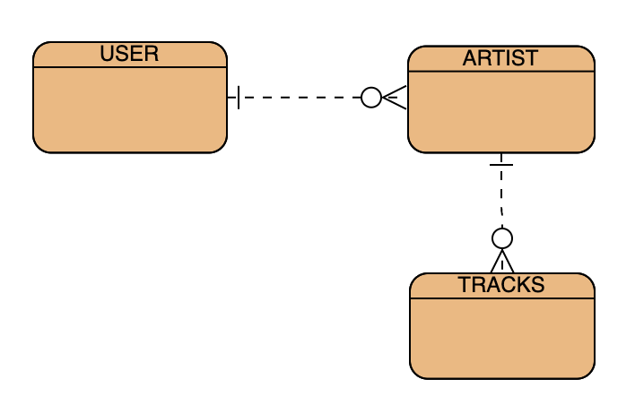

# Application Title: A Description

ArtistKey is a SPA designed to help artist managers benchmark where their artists are financially based on the average payout rate from Spotify streams. Right now, that rate sits at about $0.00318, quite low! ArtistKey allows managers to keep track of how their releases are performing monetarily.

Eventually, the application will be expanded into being able to track payout rates from multiple DSPs, such as Apple Music, Amazon, YouTube and more.

## Setup Steps

1. [Fork and clone](https://git.generalassemb.ly/ga-wdi-boston/meta/wiki/ForkAndClone) this repository.
2. Checkout to a new branch.
3. Run `pipenv shell` to start up your virtual environment.
4. Run `pipenv install` to install dependencies.
5. Generate and run migrations with `python3 manage.py makemigrations` and `python3 manage.py migrate`.
6. Run the server with `python3 manage.py runserver`.

## Important Links

- [ArtistKey Client Repo](https://github.com/rainswerld/artistkey-client)
- [Deployed API](https://git.heroku.com/artistkey-api.git)
- [Deployed Client](https://rainswerld.github.io/artistkey-client/#/)

## Planning Story

The vision for ArtistKey is to be the go to dashboard for managers to check the monetary success of their artists and help them make educated decisions in the future.

I used Notion to keep track of the models I needed to make in Django, the serializers and views that were needed to format and return the data properly to the client, and the components I needed to build in React. By breaking it down like this, I was able to focus on the functionality of one given resource at a time. This ensured that I wouldn't move on to the frontend until the backend was totally set; the models looked good, I could properly CRUD in the Django CMS, etc. Then I moved onto the front end and worked on one component at a time - CRUD-ing from the client on one resource at a time (Artist, then Track).

I focused intently on how I set up my wireframes and what my user stories are in order for the user to have a great experience while using ArtistKey.

### User Stories

- As a user, I would like to signup, signin, signout, and change password while signed in.
- As a user, I would like to be able to create 'Artists' by adding them from the Spotify API
- As a user, I would like my 'Artists' to have 'Tracks' associated with them that are taken from the Spotify API
- As a user, I would like to see my expected revenue based on current average Spotify payout rate compared agains the number of streams a certain track has

### Technologies Used

- Django
- Rest Framework
- CORS

### Catalog of Routes

Verb         |	URI Pattern
------------ | -------------
GET | /artists/
GET | /tracks/artist_id
POST | /new-artists/
POST | /tracks/artist_id
PATCH | /artists/artist_id
PATCH | /tracks/track/track_id
DELETE | /artists/artist_id
DELETE | /tracks/track/track_id

### Future Versions

Some additions I will be making on the Track Model:
- Contract splits (to allow managers to more acturately understand how much they will be paid)
- Numbers all display as comma separated values (i.e. 1,000 instead of 1000)
- Connect to the Spotify API to retrieve artist data
- Connect to other DSP APIs to retrieve data from them (Shazam, Apple Music, etc)

#### ERD:

